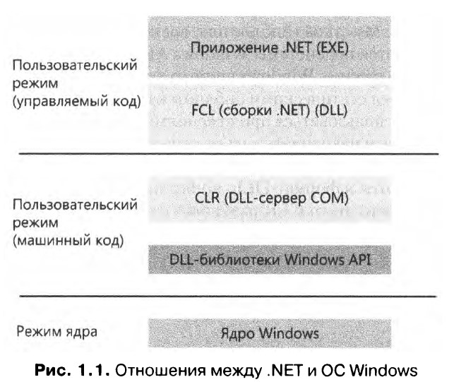

# Глава 1 Концепции и средства

- Версии операционной системы Windows

## Версии операционной системы Windows

| Название               | Версия(сборка)       | Дата релиза                      |
| ---------------------- | -------------------- | -------------------------------- |
| Windows NT 3.1         | 3.1                  | июль 1993 г.                     |
| Windows 2000           | 5.0                  | декабрь 1999 г.                  |
| Windows XP             | 5.1                  | август 2001 г.                   |
| Windows Server 2003    | 5.2                  | март 2003 г.                     |
| Windows Vista          | 6.0                  | январь 2007 г.                   |
| Windows Server 2008    | 6.0 (Service Pack 1) | март 2008 г.                     |
| Windows 7              | 6.1                  | октябрь 2009 г.                  |
| Windows 8              | 6.2                  | октябрь 2012 г.                  |
| Windows Server 2012    | 6.2                  | октябрь 2012 г.                  |
| Windows 8.1            | 6.3                  | октябрь 2013 г.                  |
| Windows 10             | 10.0 (сборка 10240)  | июль 2015 г.                     |
| Windows 10 версия 1511 | 10.0 (сборка 10586)  | ноябрь 2015 г.                   |
| Windows 10 версия 1607 | (Anniversary Update) | 10.0 (сборка 14393) июль 2016 г. |
| Windows Server 2016    | 10.0 (сборка 14393)  | октябрь 2016 г.                  |
За более свежей информацией: [Wikipedia Windows10](https://ru.wikipedia.org/wiki/Windows_10#%D0%9E%D0%B1%D0%BD%D0%BE%D0%B2%D0%BB%D0%B5%D0%BD%D0%B8%D1%8F_%D0%B8_%D0%BF%D0%BE%D0%B4%D0%B4%D0%B5%D1%80%D0%B6%D0%BA%D0%B0 "Wikipedia-Windows10").

**CMD:**

- `winver` - графическая утилита для проверки версии и сборки Windows.
- `ver` - консольная утилита для проверки версии и сборки Windows.

**API:**

- `IsWindows80rGreater, GetVersionEx`, etc.  - набор(ссылка на код в репозитории) похожих API-функций, чтобы узнать версию ОС Windows.

## Фундаментальные концепции и термины

### WindowsAPI

**Windows API** (Application Programming Interface) — программный интерфейс
пользовательского режима для ОС семейства Windows. До появления 64-разряд-
ных версий Windows программный интерфейс 32-разрядных версий ОС Windows
назывался Win32 API в отличие от исходного 16-разрядного Windows API, программного интерфейса для исходных 16-разрядных версий Windows.

### Разновидности Windows API

Изначально **Windows API** состоял только из функций в стиле С, но далее из-за неразберихи с пространствами имён и наименованиями функций (которые есть в C++) даже появился механизм - модель **COM** (Component Object Model, «модель составного объекта»), чтобы решить данную проблему.

Технология СОМ изначально создавалась для того, чтобы приложения Microsoft Office могли взаимодействовать друг с другом и передавать данные между документами. Эта функциональность получила название OLE (Object Linking and Embedding, «связывание и внедрение объектов»). Сначала
технология OLE была реализована на базе старого механизма передачи сообщений - DDE (Dynamic Data Exchange, «динамический обмен данными»). Технология DDE обладала рядом непреодолимых ограничений, поэтому был разработан новый коммуникационный механизм — СОМ. Более того,
в первом варианте, который был представлен около 1993 года, технология СОМ изначально называлась OLE 2.

СОМ базируется на двух основополагающих принципах:

- Во-первых, клиенты взаимодействуют с объектами (которые иногда называются серверными объектами СОМ) через интерфейсы — четко определенные контракты с набором логически связанных методов, сгруппированных посредством механизма диспетчеризации по виртуальным таблицам (этот же механизм обычно применяется компиляторами C++ для реализации диспетчеризации виртуальных функций). Таким образом обеспечивается двоичная совместимость и снимаются проблемы с декорированием имен компилятором. Соответственно, такие методы могут вызываться из многих других языков (и компиляторов), включая С, C++, Visual Basic, языки .NET, Delphi и т. д.
- Второй принцип — динамическая загрузка компонентов (вместо статической компоновки с клиентом).

Термин "сервер COM" обычно относится к DLL-библиотеке или исполняемому файлу (EXE), в котором реализованы класс COM.

### Windows Runtime

В Windows 8 появились новый API и исполнительная среда поддержки Windows Runtime. С точки зрения API платформа WinRT строится на базе СОМ, добавляя в базовую инфраструктуру СОМ различные расширения. С точки зрения архитектуры API она обладает намного большей целостностью, чем классические функции Windows API: в ней реализованы иерархии пространств имен, последовательная схема назначения имен и паттерны программирования.

### .NET Framework

.NET Framework является частью Windows и состоит из двух основных компонентов:

- **CLR** (Common Language Runtime). Исполнительная среда .NET; включает JIT -компилятор (Just-In-Time) для преобразования инструкций языка CIL (Common Intermediate Language) в низкоуровневый язык машинных команд процессора, уборщик мусора, систему проверки типов, безопасность обращения к коду и т. д. Среда реализована в виде внутрипроцессного сервера COM (DLL) и использует различные средства, предоставляемые Windows API.
- **.NET Framework Class Library** (FCL). Обширная подборка типов, реализующих функциональность, часто используемую в клиентских и серверных приложениях, - средства пользовательского интерфейса, поддержка сети, работа с базами данных и т.д.

### Службы, функции и процедуры

- **Функции Windows API.** Документированные, открытые для вызова процедуры Windows API. Примеры — СreateProcess, CreateFile и GetMessage.
- **Системные вызовы (низкоуровневые системные функции).** Недокументированные сервисные функции ОС, которые могут вызываться из пользовательского режима. Например, NtCreateUserProcess — внутренняя системная функция,вызываемая функцией Windows CteateProcess для создания нового процесса.
- **Вспомогательные функции ядра (процедуры).** Подпрограммы ОС Windows, которые могут вызываться только из режима ядра. Например, процедура ExAllocatePoolWithTag вызывается драйверами устройств для выделения памяти из системного пула Windows (кучи).
- **Службы Windows.** Процессы, запускаемые диспетчером служб Windows. Например, служба планировщика задач выполняется в процессе пользовательского режима, поддерживающего команду schtasks (аналог команд UNIX at и cron).
- **Библиотеки динамической компоновки (DLL).** Подпрограммы, предназначенные для внешнего вызова и объединенные в двоичные файлы, которые могут динамически загружаться приложениями, использующими эти подпрограммы.
Примеры:

  - Msvcrt.dll (библиотека времени выполнения С)
  - Kernel32.dll (одна из библиотек подсистемы Windows API).

  Приложения и компоненты пользовательского режима Windows широко используют DLL-библиотеки. Их преимущество перед статическими библиотеками заключается в том, что DLL могут совместно использоваться приложениями; система Windows позаботится
о том, чтобы в памяти находилась только одна копия кода DLL-библиотеки для всех приложений, работающих с ней. 